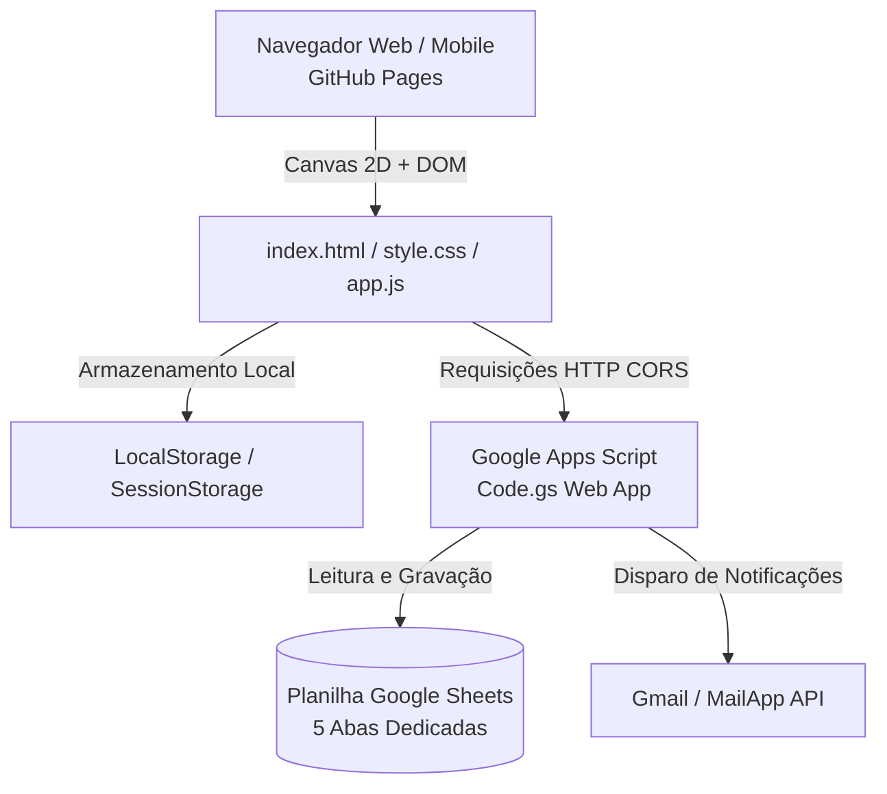

# HidroManager 🌱 - Sistema de Gestão Hidropônica NFT


> **Sistema web profissional para mapeamento espacial, monitoramento de ciclos, controle de colheitas e gestão de equipe em estufas hidropônicas NFT, com integração em nuvem gratuita via Google Sheets.**

---

## 📋 Sumário
1. [Visão Geral](#-visão-geral)
2. [Recursos Principais](#-recursos-principais)
3. [Arquitetura do Sistema](#-arquitetura-do-sistema)
4. [Como Executar o Projeto](#-como-executar-o-projeto)
5. [Configuração com o Google Sheets](#-configuração-com-o-google-sheets)
6. [Estrutura do Banco de Dados](#-estrutura-do-banco-de-dados)
7. [Segurança e Controle de Acesso](#-segurança-e-controle-de-acesso)
8. [Atalhos e Operação do Croqui](#-atalhos-e-operação-do-croqui)
9. [Publicação no GitHub Pages](#-publicação-no-github-pages)

---

## 🌟 Visão Geral

O **HidroManager** foi projetado para produtores e gestores hidropônicos que necessitam de uma ferramenta visual e prática para gerenciar a rotatividade de bancadas NFT. O sistema elimina anotações em pranchetas de papel e planilhas confusas, oferecendo um **croqui interativo em Canvas 2D**, cálculo automático de dias para colheita, histórico de tratos culturais e controle de estoque de plantas em tempo real.

Tudo isso funcionando de maneira **100% estática e serverless**: o frontend roda em qualquer navegador (computador, tablet ou celular) e os dados são salvos e sincronizados diretamente em uma **Planilha Google** através do **Google Apps Script**.

---

## 🚀 Recursos Principais

### 🗺️ Croqui Espacial Interativo (Canvas 2D)
* **Escala Métrica Real**: Conversão automática de metros para pixels com medidas técnicas precisas da estufa e bancadas.
* **Inserção Visual de Bancadas**: Posicionamento em tempo real com detecção magnética (*snap-to-grid*) e prevenção de sobreposição.
* **Ferramenta de Rotação e Espelhamento**: Rotação entre orientações horizontal e vertical (`R`) e replicação instantânea do setor esquerdo para o direito.
* **Navegação Fluida**: Suporte completo a Zoom via roda do mouse e Pan (arrasto com botão do meio ou espaço).

### 📊 Gestão de Ciclos e Status Cromático
* **Status Visual por Cores**:
  * 🟢 **Verde Claro (0% a 30%)**: Mudas recém-plantadas / fase inicial.
  * 🟢 **Verde Escuro (31% a 80%)**: Plantas em pleno desenvolvimento vegetativo.
  * 🟠 **Laranja (81% a 100%)**: Ponto de colheita atingido.
  * 🔴 **Vermelho (> 100%)**: Ciclo atrasado / colheita prioritária.
  * ⚪ **Cinza**: Bancada desocupada ou em higienização.
* **Controle de Estoque e Colheitas Parciais**: Abate fracionado de plantas com gráfico evolutivo vetorial exibindo a taxa de colheita e saldo restante na bancada.
* **Catálogo Dinâmico de Culturas**: Cadastro personalizado de espécies e variedades com ciclo médio pré-definido.

### 🧪 Rastreabilidade e Tratos Culturais
* Registro detalhado de condutividade elétrica (EC), pH, soluções nutritivas, pulverizações preventivas e manejos fitossanitários com data, hora e responsável.

### 👥 Controle de Usuários e Segurança
* **Perfis de Acesso**:
  * 👑 **Gestor Geral**: Controle total de configurações da estufa, cadastro de operadores e segurança.
  * 👨‍🌾 **Operador de Cultivo**: Registro de colheitas, manejos e plantios.
  * 👁️ **Visitante**: Modo somente leitura para consulta externa.
* **Criptografia Simétrica XOR + Base64**: Senhas dos operadores e gestor ficam criptografadas na planilha por um Código Secreto.
* **Recuperação de Senha por E-mail**: Integração nativa com `MailApp` do Google Apps Script para envio de senhas esquecidas e notificações de operadores ao Gestor.

---

## 🏗️ Arquitetura do Sistema



* **Frontend**: Vanilla JavaScript (ES6+), HTML5 Canvas 2D, Vanilla CSS3 (Design responsivo, variáveis CSS, dark/light theme).
* **Backend**: Google Apps Script rodando na nuvem do Google (Gratuito e sem custos de servidor).
* **Banco de Dados**: Google Sheets estruturado em abas relacionais com carimbo de alteração (*timestamp*).

---

## 💻 Como Executar o Projeto

Como o projeto é construído em tecnologias web puras, não é necessária a instalação de dependências ou build:

### Opção 1: Execução Local Direta
1. Clone o repositório ou baixe o código compactado:
   ```bash
   git clone https://github.com/SEU-USUARIO/Gerenciador-de-Cultivo.git
   ```
2. Abra a pasta do projeto e dê um duplo clique no arquivo `index.html` para abrir no navegador padrão.
3. *(Opcional)* Se utilizar o VS Code, utilize a extensão **Live Server** para rodar em `http://localhost:5500`.

### Opção 2: Acesso Online (GitHub Pages)
O projeto pode ser acessado diretamente através da URL publicada no GitHub Pages.

---

## 📑 Configuração com o Google Sheets

Para conectar o sistema a uma planilha do Google e ter persistência em nuvem:

1. **Crie uma Planilha no Google Drive**: Dê o nome de `HidroManager - Banco de Dados`.
2. **Abra o Apps Script**: Na planilha, vá em **Extensões ➔ Apps Script**.
3. **Cole o Código**: Substitua o código existente pelo conteúdo do arquivo `Code.gs`.
4. **Instale as Abas com 1 Clique**:
   * No menu suspenso de funções, selecione `setupPlanilha` e clique em **▶ Executar**.
   * Conceda as permissões solicitadas pela sua conta Google.
5. **Implante como Web App**:
   * Clique em **Implantar ➔ Nova implantação**.
   * Tipo: **App da Web**.
   * Executar como: **Eu (seu e-mail)**.
   * Quem tem acesso: **Qualquer pessoa** (*Anyone*).
   * Clique em **Implantar** e copie a **URL do App da Web**.
6. **Conecte no Sistema**:
   * No HidroManager, clique em **⚙️ Opções ➔ Google Sheets**.
   * Cole a URL obtida e clique em **Salvar Conexão**.

> 📖 **Para o passo a passo ilustrado com capturas e solução de dúvidas, consulte o guia completo em [CriarPlanilha.md](CriarPlanilha.md).**

---

## 🗄️ Estrutura do Banco de Dados

A planilha Google criada pelo script organiza os dados em 5 abas padronizadas:

| Aba | Descrição | Principais Colunas |
| :--- | :--- | :--- |
| **`Areas`** | Dimensões e parâmetros da estufa | `id_area`, `nome`, `comprimento_m`, `largura_m`, `largura_corredor_m` |
| **`Blocos`** | Bancadas físicas cadastradas no croqui | `id_bloco`, `tipo_bloco`, `setor`, `pos_x_m`, `pos_y_m`, `qtd_perfis`, `total_furos` |
| **`Ciclos_Cultivo`** | Lotes de cultivo ativos e histórico | `id_ciclo`, `id_bloco`, `cultura`, `data_plantio`, `qtd_inicial`, `qtd_restante`, `colheitas_json` |
| **`Tratos_Culturais`** | Histórico de adubações e manejos | `id_trato`, `id_bloco`, `id_ciclo`, `data_hora`, `tipo_manejo`, `responsavel`, `observacoes` |
| **`Usuarios`** | Credenciais criptografadas e e-mail | `id_usuario`, `nome_exibicao`, `papel`, `dados_codificados`, `email_recuperacao` |

---

## 🔒 Segurança e Controle de Acesso

* **Criptografia Simétrica Reversível**: Os operadores cadastrados pelo Gestor têm suas credenciais cifradas via XOR compatível com UTF-8 Base64 utilizando o **Código Secreto de Criptografia**. Terceiros com acesso visual à planilha só visualizam códigos indecifráveis.
* **Alteração de Código a Qualquer Momento**: O Gestor pode alterar a chave de criptografia quando desejar; o sistema re-codifica todas as senhas da equipe e atualiza a planilha automaticamente.
* **Recuperação de Senha Segura**:
  * **Gestor**: Pode solicitar o envio automático de sua senha e chave secreta para seu e-mail cadastrado.
  * **Operador**: Possui botão de solicitação que dispara um e-mail de aviso diretamente para a caixa de entrada do Gestor.

---

## ⌨️ Atalhos e Operação do Croqui

| Ação | Atalho / Comando |
| :--- | :--- |
| **Girar Bancada** | Pressione **`R`** no teclado ou clique no botão girar durante a inserção |
| **Zoom In / Out** | Role a **Roda do Mouse (Scroll)** sobre o croqui |
| **Mover Croqui (Pan)** | Clique e arraste com o **Botão do Meio do Mouse** ou segure **`Espaço` + Botão Esquerdo** |
| **Fixar Bancada** | Clique com o **Botão Esquerdo** na posição desejada |
| **Cancelar Ação** | Pressione **`Esc`** |
| **Inspecionar Bancada** | Clique sobre a bancada no croqui para abrir o painel lateral de ações |

---


## 📄 Licença

Distribuído sob a licença **MIT**.

Desenvolvido para impulsionar a agricultura protegida e sustentável com tecnologia limpa e acessível! 🌱
