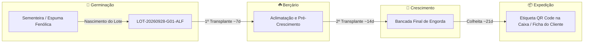

# 🔍 Especificação Funcional e Técnica: Módulo de Rastreabilidade & Certificação de Lotes (HidroManager)

> **Documento de Arquitetura, Requisitos de Negócio e Roteiro de Implementação**  
> *Este documento detalha o planejamento, o modelo de dados, a experiência do usuário (UX) e os componentes técnicos para a implementação da **Rastreabilidade de Ponta a Ponta (Seed-to-Table)** no HidroManager.*

---

## 1. Visão Geral e Objetivos de Negócio

O **Módulo de Rastreabilidade** transforma o HidroManager em uma plataforma de **auditoria e segurança alimentar (Food Safety)** para produtores hidropônicos comerciais.

A separação do cultivo em **3 fases (Germinação ➔ Berçário ➔ Crescimento/Engorda)** cria a base ideal para que cada lote de plantas possua uma **linhagem cronológica contínua e auditável**.



### Principais Benefícios:
1. **Conformidade Legal & Certificação**: Atendimento pleno à Instrução Normativa Conjunta **MAPA/ANVISA (INC 02/2018)**, que exige identificação de origem, tratos culturais e destino para hortaliças comercializadas no Brasil.
2. **Diferencial Comercial B2B (Restaurantes, Supermercados e Hotéis)**: Compradores exigem segurança de que o alimento foi monitorado, permitindo que o produtor cobre valor agregado por maço/embalagem certificada.
3. **Engajamento B2C**: O cliente final no supermercado escaneia o QR Code na embalagem e visualiza a "Certidão de Nascimento" da hortaliça (quando foi semeada, estufa de origem, métodos limpos sem agrotóxicos).
4. **Recall e Gestão de Qualidade Interna**: Em caso de contaminação microbiológica ou queima de borda, o produtor identifica em segundos todas as bancadas por onde aquele lote passou e quais lotes compartilharam a mesma solução nutritiva.

---

## 2. Padrão Estrutural do Código de Lote (`Lote Rastreável`)

Para garantir uniformidade e facilidade de leitura tanto por humanos quanto por leitores de código de barras/QR Code, adota-se a codificação semântica:

```
LOT-YYYYMMDD-ORIG-CULT[-SEQ]
```

### Exemplos Reais:
* `LOT-20260928-G01-ALFC01`: Lote semeado em 28/09/2026 no módulo `G-01`, contendo *Alface Crespa*, lote sequencial 01.
* `LOT-20261002-G02-RUC01`: Lote semeado em 02/10/2026 no módulo `G-02`, contendo *Rúcula*.

> [!NOTE]
> **Princípio da Continuidade**: O código de lote **permanece o mesmo** quando a muda sai da Germinação para o Berçário e do Berçário para o Crescimento. O que se adiciona é o histórico de transplantes em sua cadeia de custódia.

---

## 3. As 4 Funcionalidades Chave do Módulo

### 3.1. 🔎 Consulta e Filtro Rápido de Lotes
Um painel centralizado permitindo ao gestor ou auditor consultar qualquer lote histórico ou ativo:
* **Filtros Rápidos**:
  * Por Status: `🟢 Em Germinação`, `🟡 Em Berçário`, `🌿 Em Crescimento`, `🌾 Colhido / Finalizado`.
  * Por Cultura: `Alface Crespa`, `Rúcula`, `Agrião`, etc.
  * Por Período: Semeaduras do mês, colheitas da semana.
  * Por Cliente / Destino: Restaurante Sabor, Feira Central, Ceasa, etc.
* **Barra de Busca Inteligente**: Busca instantânea por parte do código do lote, nome do operador, bancada ou nota de remessa.

---

### 3.2. 🌳 Árvore Genealógica e Linha do Tempo Interativa (Timeline)
Visualização gráfica em formato de linha do tempo horizontal ou vertical (estilo *stepper*), mostrando todos os eventos da vida da planta:

```
[2026-09-28 08:00] 🧫 SEMEADURA & GERMINAÇÃO
├─ Módulo: G-01 (Módulo de Germinação)
├─ Variedade: Grand Rapids | Substrato: Espuma Fenólica (196 células/placa)
├─ Nutrição Inicial: Água pura / Solução EC 0.6 mS
└─ Responsável: João Silva (Gestor)
       │
       ▼ (7 dias depois)
[2026-10-05 07:45] ☘️ 1º TRANSPLANTE (PARA BERÇÁRIO)
├─ Movimentação: G-01 ➔ Bancada B-04 (Berçário)
├─ Quantidade: 196 mudas transferidas
├─ Condutividade Operacional: EC 1.3 mS | pH 5.9
├─ Ordem de Serviço vinculada: #TAR-104
└─ Operador Executor: Carlos Silva
       │
       ▼ (12 dias depois)
[2026-10-17 07:15] 🌱 2º TRANSPLANTE (PARA CRESCIMENTO / ENGORDA)
├─ Movimentação: B-04 ➔ Bancada B-01 (Crescimento)
├─ Quantidade: 192 plantas alocadas (4 descartes na triagem)
├─ Reservatório: TANQUE-ESQ (5.000 L) | EC 1.7 mS
├─ Manejos aplicados no leito: Limpeza de canaletas, desobstrução de microtubos
└─ Operador Executor: Marcos Souza
       │
       ▼ (21 dias depois)
[2026-11-07 06:30] 🌾 COLHEITA FINAL & EXPEDIÇÃO
├─ Bancada de Origem: B-01
├─ Quantidade Colhida: 185 unidades comerciais (7 perdas naturais de ciclo)
├─ Destino / Cliente: Restaurante Bella Vista (Entrega matinal)
├─ Responsável pela Colheita: Marcos Souza
└─ Certificado Digital: Emitido via QR Code #LOT-20260928-G01-ALFC01
```

---

### 3.3. 🏷️ Gerador de Etiquetas com QR Code para Caixas e Maços

Geração com **1 clique** de etiquetas prontas para impressão direta (impressoras térmicas Zebra/Argox padrão 100mm x 50mm ou folhas A4 com grade adesiva 2x5):

#### Estrutura Visual da Etiqueta:
```
+-----------------------------------------------------------+
|  🌿 HIDROMANAGER - ESTUFA BOA VISTA                       |
|  ALFACE CRESPA (Grand Rapids)                             |
+-----------------------------------------------------------+
|  LOTE: LOT-20260928-G01-ALFC01                            |
|  Colheita: 07/11/2026     | Validade Prevista: 14/11/2026 |
|  Bancada Final: B-01      | Quantidade: 20 un / cx        |
|  Cliente: Restaurante Bella Vista                         |
+--------------------------------+--------------------------+
|  [     QR CODE ESCANEÁVEL    ] | 🍃 Cultivo Hidropônico   |
|  [    (Redireciona para      ] | Sem uso de agrotóxicos   |
|  [  Ficha Pública do Lote)   ] | Origem 100% Rastreada    |
+--------------------------------+--------------------------+
```

#### O que acontece ao escanear o QR Code?
* O smartphone abre uma **página web pública responsiva** (sem necessidade de login):
  * Nome do produtor e da estufa;
  * Foto da cultura e data exata da colheita;
  * Resumo das etapas de cultivo (placas ➔ berçário ➔ crescimento);
  * Parâmetros de qualidade da água e sustentabilidade (economia de até 90% de água em relação ao cultivo tradicional em solo).

---

### 3.4. 📄 Dossiê / Relatório Técnico para Auditoria e Clientes

Geração de documento em formato PDF ou impressão A4 contendo:
* Cabeçalho com dados da propriedade rural (CNPJ/CPF, Inscrição Estadual, Localização).
* Ficha completa do lote com tabela de insumos e nutrientes aplicados.
* Gráfico de parâmetros (evolução de pH, EC e dias de cada fase).
* Histórico de operadores que manusearam as mudas em cada etapa.
* Campo de assinatura do Responsável Técnico (Agrônomo / Técnico Agrícola).

---

## 4. Modelo de Dados Técnico

A estrutura em JSON no `AppState` e armazenada no `localStorage` sob a chave `hidro_lotes_v1`:

```json
{
  "codigo_lote": "LOT-20260928-G01-ALFC01",
  "cultura": "Alface Crespa",
  "variedade": "Grand Rapids",
  "status_atual": "colhido",
  "fase_atual": "expedicao",
  "data_inicio_semeadura": "2026-09-28T08:00:00.000Z",
  "data_colheita_final": "2026-11-07T06:30:00.000Z",
  "qtd_semeada": 196,
  "qtd_colhida": 185,
  "cliente_destino": "Restaurante Bella Vista",
  "id_bloco_semeadura": "G-01",
  "id_bloco_final": "B-01",
  "etapas": [
    {
      "fase": "germinacao",
      "id_bloco": "G-01",
      "id_ciclo": "CICLO-1727521000",
      "data_entrada": "2026-09-28T08:00:00.000Z",
      "data_saida": "2026-10-05T07:45:00.000Z",
      "dias_reais": 7,
      "operador": "João Silva",
      "substrato": "Espuma Fenólica",
      "qtd_entrada": 196,
      "qtd_saida": 196
    },
    {
      "fase": "bercario",
      "id_bloco": "B-04",
      "id_ciclo": "CICLO-1728114300-TRANS",
      "data_entrada": "2026-10-05T07:45:00.000Z",
      "data_saida": "2026-10-17T07:15:00.000Z",
      "dias_reais": 12,
      "operador": "Carlos Silva",
      "id_tarefa_transplante": "TAR-104",
      "qtd_entrada": 196,
      "qtd_saida": 192
    },
    {
      "fase": "crescimento",
      "id_bloco": "B-01",
      "id_ciclo": "CICLO-1729149300-TRANS",
      "data_entrada": "2026-10-17T07:15:00.000Z",
      "data_saida": "2026-11-07T06:30:00.000Z",
      "dias_reais": 21,
      "operador": "Marcos Souza",
      "id_tanque": "TANQUE-ESQ",
      "qtd_entrada": 192,
      "qtd_saida": 185
    }
  ],
  "tratos_culturais_vinculados": [
    {
      "data_hora": "2026-10-06T09:00:00.000Z",
      "tipo_manejo": "Correção de pH Berçário",
      "responsavel": "Carlos Silva",
      "observacoes": "pH ajustado de 6.4 para 5.8."
    }
  ]
}
```

---

## 5. Integração com Google Sheets (`Code.gs`)

### Nova Aba na Planilha: `Rastreabilidade`
Adicionar a 7ª aba estruturada na planilha Google para backup cumulativo e relatórios de safra:

| Coluna | Nome do Campo | Descrição |
| :---: | :--- | :--- |
| **A** | `codigo_lote` | Identificador único (ex: `LOT-20260928-G01-ALFC01`) |
| **B** | `cultura` | Cultura (ex: `Alface Crespa`) |
| **C** | `variedade` | Variedade botânica (ex: `Grand Rapids`) |
| **D** | `data_semeadura` | Data inicial na germinação |
| **E** | `data_colheita` | Data final de colheita |
| **F** | `modulo_germinacao` | Módulo de nascimento (ex: `G-01`) |
| **G** | `bancada_bercario` | Bancada intermediária (ex: `B-04`) |
| **H** | `bancada_crescimento`| Bancada de colheita (ex: `B-01`) |
| **I** | `qtd_semeada` | Quantidade de mudas iniciadas |
| **J** | `qtd_colhida` | Quantidade final entregue |
| **K** | `cliente_destino` | Cliente ou canal de expedição |
| **L** | `operador_colheita` | Operador que realizou a colheita |
| **M** | `status` | `em_cultivo`, `colhido`, `descartado` |
| **N** | `dados_json` | JSON completo com timeline e tratos culturais |

---

## 6. Interface de Usuário Proposta (UI / UX)

### 1. Botão na Navbar Principal:
```html
<button id="btn-menu-rastreabilidade" class="tool-btn" title="Rastreabilidade e Linhagem de Lotes">
  <span>🔍</span>
  <span>Rastreabilidade</span>
</button>
```

### 2. Modal Central de Rastreabilidade (`#modal-rastreabilidade`):
* **Cabeçalho com Abas Modernas**:
  * `📋 Todos os Lotes`: Lista com cards de visualização rápida de status, cultura e dias totais.
  * `🌳 Linha do Tempo & Linhagem`: Visualização detalhada do lote selecionado com a árvore de fases.
  * `🏷️ Emissor de Etiquetas`: Pré-visualização e impressão de etiquetas térmicas e A4.
* **Barra de Pesquisa Instantânea**: Campo de input com foco automático para escanear código de barras físico ou digitar código do lote.
* **Botões de Ação por Lote**:
  * `🌳 Ver Árvore de Linhagem`
  * `🏷️ Imprimir Etiqueta QR Code`
  * `📄 Exportar Ficha PDF`

### 3. Modal de Impressão de Etiquetas (`#modal-imprimir-etiqueta`):
* Seletor de formato:
  * `Impressora Térmica (100mm x 50mm)` (1 etiqueta por envio)
  * `Folha A4 Adesiva (Padrão Pimaco / 10 etiquetas por folha)`
* Quantidade de cópias a imprimir (ex: 5 caixas = 5 etiquetas).
* Botão direto `🖨️ Imprimir Agora` acionando `@media print` otimizado em CSS puro sem depender de softwares externos.

---

## 7. Roteiro de Implementação Sugerido (Passo a Passo)

Para uma entrega consistente e sem interrupções operacionais:

1. **Etapa 1: Motor de Reconstrução de Lote & Busca**
   - Função utilitária no `app.js` que consolida os dados de `AppState.ciclos`, `AppState.tratos` e `AppState.tarefas` por `lote_rastreabilidade`.
   - Modal de consulta com listagem de lotes ativos e colhidos.

2. **Etapa 2: Linha do Tempo Visual (Stepper de Fases)**
   - Componente visual conectando Germinação ➔ Berçário ➔ Crescimento com badges de dias, bancadas e operadores.
   - Detalhamento de tratos culturais recebidos ao longo do ciclo.

3. **Etapa 3: Emissão de Etiquetas com QR Code Nativo**
   - Inclusão de gerador de QR Code leve (SVG/Canvas em Vanilla JS).
   - Estilização CSS para impressão padrão 100x50mm e A4.

4. **Etapa 4: Ficha Pública do Lote (Página Web Pública)**
   - Endpoint ou página estática acessível pelo QR Code da embalagem para apresentação aos clientes e restaurantes.
   - Sincronização automática com a aba `Rastreabilidade` no Google Sheets.

---

> [!TIP]
> A base técnica (geração de `lote_rastreabilidade`, gravação de `fase_atual`, `origem_ciclo_id` e `historico_transplantes`) **já está 100% implementada e ativa** no código atual do sistema. O próximo passo será construir a camada visual e o emissor de etiquetas conforme detalhado nesta especificação.
