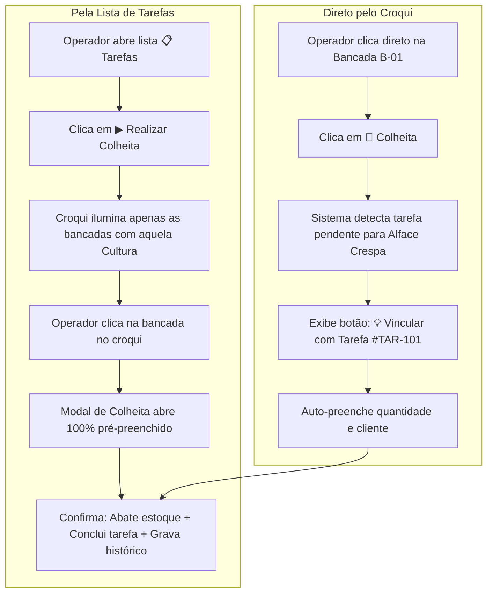

# 📋 Especificação Funcional e Técnica: Módulo de Tarefas & Alertas (HidroManager)

> **Documento de Referência Arquitetural e Requisitos de Negócio**  
> *Este documento consolida todo o alinhamento realizado para orientar a futura implementação da funcionalidade de **Gestão de Tarefas, Ordens de Serviço e Alertas Operacionais** no HidroManager.*

---

## 1. Visão Geral do Módulo

O **Módulo de Tarefas** transforma o HidroManager de um sistema de croqui e monitoramento passivo em um **ERP Operacional Ativo para Casas de Vegetação / Estufas Hidropônicas**.

### Objetivos Principais:
1. **Comunicação Direta Gestor ➔ Operador**: O Gestor emite ordens de colheita, semeadura, manejos e manutenções com quantidades, prazos e clientes definidos.
2. **Execução em 1 Clique integrada ao Croqui**: O operador cumpre a tarefa no croqui sem precisar redigitar dados de colheita ou cliente; o estoque da bancada é abatido e a tarefa é finalizada simultaneamente.
3. **Comunicação Inversa Operador ➔ Gestor (Alertas / Chamados)**: Quem está na lida diária reporta instantaneamente falta de adubo/insumo, vazamentos, problemas de bombas ou focos de pragas.
4. **Rastreabilidade e Registro Cumulativo**: Nenhuma tarefa concluída é apagada; tudo fica salvo no histórico da estufa e sincronizável na nuvem (Google Sheets).

---

## 2. Estrutura de Perfis & Permissões (RBAC)

| Ação no Módulo | Perfil Gestor 🛡️ | Perfil Operador 👷 |
| :--- | :---: | :---: |
| Visualizar lista de tarefas e prazos | ✅ Sim | ✅ Sim |
| Criar novas tarefas para a equipe | ✅ Sim | ❌ Não |
| Executar / Dar baixa em tarefas | ✅ Sim | ✅ Sim |
| Cancelar ou excluir tarefas | ✅ Sim | ❌ Não |
| Abrir **Alertas / Chamados Rápidos** (insumos, bombas, pragas) | ✅ Sim | ✅ Sim |
| Marcar alertas como resolvidos | ✅ Sim | ❌ Não (Apenas Gestor) |

---

## 3. Modelo de Dados da Tarefa (`Tarefa`)

A estrutura em JSON no `AppState.tarefas` e no `localStorage`:

```json
{
  "id_tarefa": "TAR-101",
  "tipo": "colheita", 
  "titulo": "Colheita de Alface para Restaurante Sabor",
  "cultura": "Alface Crespa",
  "variedade": "Grand Rapids",
  "quantidade": 80,
  "unidade": "plantas",
  "destino": "Restaurante Sabor (Entrega 11h)",
  "bancada_sugerida": "B-01",
  "prazo_data": "2026-09-26",
  "prazo_turno": "manha",
  "prioridade": "urgente",
  "status": "pendente",
  "criado_por": "Gestor Principal",
  "atribuido_para": "Carlos Silva",
  "data_criacao": "2026-09-25T10:00:00.000Z",
  "executado_por": null,
  "data_conclusao": null,
  "id_bloco_executado": null,
  "id_ciclo_vinculado": null,
  "observacoes": "Separar caixas limpas de 20 unidades cada."
}
```

### Tipos de Tarefas Suportadas:
* `colheita`: Colheita comercial com abate automático no estoque da bancada.
* `transplante`: Transferência de mudas de germinação para berçário ou definitiva.
* `semeadura`: Preparo e semeadura de placas de espuma fenólica.
* `nutricao`: Correção de condutividade elétrica (EC) ou pH em reservatório.
* `manutencao`: Limpeza de calhas, troca de filtros, checagem de motores/bombas.
* `geral`: Tarefas gerais da casa de vegetação (organização, sanitização, etc.).

### Matriz de Prioridade & Código de Cores:
* 🔴 **Vermelho (`urgente`)**: Para hoje ou com prazo vencido / entrega prioritária de clientes.
* 🟡 **Laranja / Amarelo (`atencao`)**: Prazo para amanhã ou próximas 48 horas.
* 🟢 **Verde / Azul (`normal` / `agendada`)**: Planejado para o fim da semana ou rotina programada.

---

## 4. Dinâmica de Execução Integrada ao Croqui

Para máxima praticidade no campo (operador com celular ou tablet), o sistema adota **dois fluxos complementares**:



### Detalhamento dos Fluxos:

#### 🔹 Fluxo A (Pela Janela de Tarefas):
1. O colaborador acessa a Navbar e clica em **`📋 Tarefas`**.
2. Vê a tarefa pendente: *"Colheita 80 un Alface Crespa — Restaurante Sabor (Urgente)"*.
3. Clica no botão **`▶ Realizar`**.
4. O modal se fecha e o **Canvas do Croqui entra no modo de seleção assistida**:
   - Todas as bancadas que **não contêm** *Alface Crespa* ficam translúcidas (opacas).
   - As bancadas com *Alface Crespa* ativa ficam destacadas com contorno pulsante.
   - Um banner superior informa:  
     `🎯 Selecione no croqui de qual bancada deseja colher as 80 plantas de Alface Crespa.`
5. Ao clicar na bancada escolhida (ex: `B-01`):
   - Abre-se imediatamente o modal de colheita com:
     - Quantidade: `80`
     - Destino: `Restaurante Sabor (Entrega 11h)`
     - Observações: `Vinculado à Tarefa #TAR-101`
6. O operador confirma. A bancada tem 80 plantas deduzidas, o histórico de tratos é registrado e a tarefa `#TAR-101` passa para `concluida`.

#### 🔹 Fluxo B (Pelo Croqui da Estufa):
1. O operador já está na frente da bancada `B-01` e clica sobre ela no croqui.
2. Clica em **`🌾 Registrar Colheita`**.
3. O modal detecta automaticamente que existe uma tarefa pendente para a cultura daquela bancada.
4. Exibe um banner dinâmico no topo do modal:  
   `💡 Tarefa pendente encontrada: "Restaurante Sabor (80 un)". [Preencher Dados da Tarefa]`
5. Ao clicar no banner, os campos são preenchidos instantaneamente.

---

## 5. Módulo de Alertas & Chamados Operacionais (Operador ➔ Gestor)

O operador na lida diária identifica problemas antes de qualquer sensor. O sistema disponibiliza uma aba ou botão rápido:

👉 **`⚠️ Novo Alerta / Chamado para o Gestor`**

### Categorias de Alerta:
1. 📦 **Falta de Insumo / Adubação**:
   * *Nitrato de Cálcio / Quelato de Ferro esgotando.*
   * *Falta de embalagens de entrega ou caixas.*
2. 🔧 **Equipamento & Estrutura**:
   * *Bomba do setor direito com ruído ou vazamento no cavalete.*
   * *Filme plástico do teto rasgado ou tela antiafídeos danificada.*
   * *Microtubos ou bicos injetores entupidos na bancada B-03.*
3. 🐛 **Sanidade Vegetal / Pragas**:
   * *Mancha foliar suspeita, lagarta ou queima de borda observada.*

### Comportamento Visual:
* O Gestor ao acessar o sistema vê um alerta com contador no menu:  
  `⚠️ Alertas (1 novo)`
* O Gestor pode visualizar o chamado, tomar providência e clicar em **`✅ Marcar como Resolvido`**.

---

## 6. Interface de Usuário (UI / Componentes)

### 1. Botão na Navbar Principal:
* Posicionado próximo aos botões de ação:
  ```html
  <button id="btn-menu-tarefas" class="tool-btn" title="Tarefas da Equipe e Alertas">
    <span>📋</span>
    <span>Tarefas</span>
    <span id="badge-tarefas-pendentes" class="badge-count">2</span>
  </button>
  ```
* Se houver tarefas com prazo urgente para hoje, o badge recebe animação pulsante sutil (`pulse-urgente`).

### 2. Modal / Painel de Tarefas (`#modal-tarefas`):
* **Abas Superiores:**
  * `📌 Pendentes (X)`
  * `✅ Concluídas (Y)`
  * `⚠️ Chamados & Alertas (Z)`
* **Ações no Topo:**
  * Se for Gestor: Botão **`+ Nova Tarefa`**.
  * Se for Operador: Botão **`+ Abrir Alerta`**.
* **Filtros Rápidos:**
  * Filtro por Colaborador (`Todos`, `Meu Turno`, `Carlos`, etc.).
  * Filtro por Prioridade (`Todas`, `🔴 Urgentes`, `🟡 Próximas`).
* **Cards de Tarefa:**
  * Visual limpo com tag colorida da cultura, badge de quantidade, cliente/destino e prazo.
  * Botão de ação direta `▶ Realizar Colheita` / `▶ Executar`.

---

## 7. Banco de Dados & Google Sheets

### Aba 6 da Planilha: `Tarefas`
Adicionar uma nova aba na planilha Google sincronizada com os seguintes cabeçalhos:

| Coluna | Nome do Campo | Descrição |
| :---: | :--- | :--- |
| **A** | `id_tarefa` | Identificador único (ex: `TAR-1727289100`) |
| **B** | `tipo` | `colheita`, `transplante`, `nutricao`, `manutencao` |
| **C** | `titulo` | Título legível da tarefa |
| **D** | `cultura` | Cultura vinculada (ex: `Alface Crespa`) |
| **E** | `quantidade` | Número de unidades/plantas |
| **F** | `destino` | Cliente / Destino da produção |
| **G** | `bancada_sugerida` | ID da bancada sugerida (ex: `B-01`) ou vazio |
| **H** | `prazo_data` | Data limite (YYYY-MM-DD) |
| **I** | `prioridade` | `urgente`, `atencao`, `normal` |
| **J** | `status` | `pendente`, `concluida`, `cancelada` |
| **K** | `criado_por` | Nome do Gestor |
| **L** | `atribuido_para` | Colaborador designado |
| **M** | `executado_por` | Operador que finalizou |
| **N** | `data_criacao` | Data/hora de criação ISO |
| **O** | `data_conclusao` | Data/hora de finalização ISO |
| **P** | `id_bloco_executado`| Bancada real de onde foi realizada a colheita |
| **Q** | `observacoes` | Observações técnicas e notas |

### Política de Histórico e Peso de Dados:
* Nenhuma tarefa concluída é excluída.
* O sistema salva no `localStorage` sob a chave `hidro_tarefas_v1`.
* Na renderização diária, o sistema aplica filtragem sob demanda (*Lazy*): exibe por padrão as tarefas pendentes e os últimos 15 dias de concluídas, mantendo o carregamento em **milissegundos**.
* Integração com o recurso planejado de **`📦 Arquivamento Anual de Safra`**.

---

## 8. Status da Implementação

A funcionalidade foi **100% implementada e refinada com sucesso**:

1. **Estado Global (`app.js`)** ✅:
   - `AppState.tarefas = []` e `AppState.alertas = []` integrados ao ciclo de vida da aplicação.
   - `AppState.modalNovaTarefaAberto`: controle de estado do drawer interativo de criação de tarefas.
   - `carregarTarefasLocal()` e `salvarTarefasLocal()` com persistência local e inicialização inteligente.
   - `atualizarBadgeTarefas()` com suporte a pulso de urgência para tarefas de hoje ou atrasadas.

2. **Estrutura HTML & Interface Lateral (`index.html`)** ✅:
   - Botão `#btn-menu-tarefas` com contador e badge dinâmico na navbar.
   - Modal `#modal-tarefas` com abas dinâmicas (`📌 Pendentes`, `✅ Concluídas`, `⚠️ Alertas`).
   - **Drawer Lateral `#modal-nova-tarefa`**: abre acoplado ao canto direito da tela (`.drawer-lateral-card`), mantendo o croqui (canvas) 100% visível e interativo.
   - Seção interativa de **Local Sugerido** com chips dinâmicos, contagem de bancadas e botões rápidos (`🏛️ Toda a Estufa`, `💧 Reservatórios`, `🧹 Limpar`).
   - Modal `#modal-novo-alerta` com formulário rápido para o Operador.
   - Banner de modo assistido flutuante `#tarefa-selecao-banner` no Canvas.
   - Banner de detecção de tarefa vinculada `#colheita-tarefa-banner` no modal de colheita.

3. **Design, Tipografia & Estilos CSS (`style.css`)** ✅:
   - **Tipografia ampliada**: fontes aumentadas nos cards de tarefas (`1.08rem` no título, `0.9rem` nos metadados, `0.95rem` nas abas e botões confortáveis).
   - Estilização do drawer lateral com sombra suave, overlay sem bloqueio de cliques no croqui (`pointer-events: none` no overlay, `pointer-events: auto` no drawer).
   - Chips de locais sugeridos com badges modernos e botão de remoção rápida.
   - Destaque das bancadas marcadas no croqui em tempo real com bordas tracejadas e realce azul suave.

4. **Regras de Negócio e Interatividade (`app.js`)** ✅:
   - **Desobstrução do Croqui e Modais Sem Conflito**: ao clicar em "+ Nova Tarefa", o modal central `#modal-tarefas` é recolhido automaticamente para que o croqui fique 100% visível; o drawer inclui botão "← Voltar" e restaura a lista de tarefas ao ser fechado.
   - **Confirmação Prévia de Criação**: diálogo de confirmação detalhado antes de emitir a Ordem de Serviço, exibindo resumo completo de tipo, origem, destino, prazo e prioridade.
   - **Fluxo de Transplante (Origem ➔ Destino)**:
     - Campo `#grupo-tarefa-origem` para selecionar o módulo de germinação ou berçário de onde saem as mudas.
     - Título e cards intuitivos exibindo o trajeto completo: `🌱 Transplante: de G-01 ➔ para B-03, B-04`.
     - Ao selecionar a bancada de origem, a cultura e a quantidade de mudas disponíveis são preenchidas automaticamente.
   - **Execução Livre no Campo & Bancadas Vagas**:
     - O operador tem liberdade total para escolher qualquer bancada para a execução da tarefa.
     - Se selecionar uma bancada diferente da sugerida pelo Gestor, o sistema solicita justificativa operacional (`motivo_troca_bancada`), gravando no histórico da tarefa e da bancada.
     - **Bancadas vagas aceitam transplante normalmente**: o sistema cria o ciclo ativo no destino, abate as mudas da bancada de origem, gera os registros de tratos e conclui a ordem de serviço em 1 clique.
   - **Culturas Ativas Corrigidas**: validação por `c.status === "ativo"`, agrupando as culturas com indicação de bancadas, além do catálogo completo.
   - **Seleção Interativa no Croqui**: clique direto nas bancadas para adicionar/remover locais sugeridos com destaque visual em tempo real.
   - **Destino / Cliente Contextual**: visível exclusivamente para colheita comercial.

5. **Integração com Google Sheets (`Code.gs` e Webhook)** ✅:
   - Criação automática das abas `Tarefas` e `Alertas`.
   - Rotas remotas `criarTarefa`, `concluirTarefa`, `cancelarTarefa`, `criarAlerta` e `resolverAlerta`.
   - Sincronização bidirecional no `sincronizarComSheets()` e suporte a backup JSON completo.

